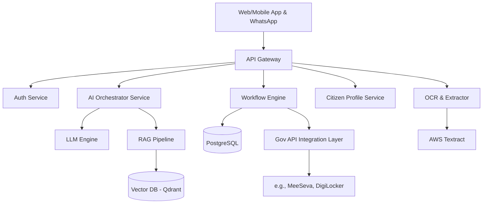

# Saarthi AI – Your AI Guide Through Government Services

## SECTION 1: Executive Summary
Saarthi AI is an AI-powered Government Navigator designed to bridge the gap between citizens and fragmented government services. By allowing citizens to express their goals in natural language, Saarthi AI automatically generates customized, end-to-end roadmaps—detailing required services, document checklists, approval sequences, and relevant schemes. It acts as a personalized digital charioteer, guiding citizens through the bureaucratic maze.

## SECTION 2: Problem Statement
Citizens face extreme friction accessing government services due to:
- **Fragmentation:** Procedures are scattered across multiple departments and portals.
- **Opacity:** Lack of clarity on correct document sequences and mandatory approvals.
- **Complexity:** Repetitive manual entry and dense bureaucratic terminology.
- **Scheme Unawareness:** Eligible citizens miss out on welfare schemes due to complex criteria.

## SECTION 3: Background Research
Currently, e-Governance initiatives have digitized individual services, but they remain siloed. A citizen wanting to "open a restaurant" must independently figure out they need FSSAI, Trade License, Fire NOC, and GST. There is no horizontal layer connecting these vertical silos based on the *citizen's intent*.

## SECTION 4: Market Opportunity
- **TAM:** 1.4 Billion Indian Citizens, 60M+ MSMEs.
- **SAM:** 300M+ Smartphone users actively interacting with G2C services.
- **SOM:** 35M citizens in Telangana/Andhra Pradesh (initial target market).
- **Opportunity:** Transforming G2C interactions from "search-and-stumble" to "intent-and-guide," aligning with the Digital India vision.

## SECTION 5: Current Challenges Faced By Citizens
1. **Discovery:** "What exactly do I need to do?"
2. **Prerequisites:** "What documents are required for this specific certificate?"
3. **Sequencing:** Applying for Document B requires Document A, but the citizen only finds out after applying for B.
4. **Language Barriers:** Complex English/administrative language alienates rural or non-technical citizens.

## SECTION 6: Target Audience
- **MSME Owners:** Starting businesses, shops, or agencies.
- **General Citizens:** Applying for birth, marriage, death, or caste certificates.
- **Farmers:** Applying for agricultural subsidies, land registration, or crop insurance.
- **Students:** Seeking scholarships, income certificates, and educational loans.

## SECTION 7: User Personas
1. **Ramesh (45, Farmer):** Needs to register land but doesn't understand the complex legal steps or which local office to visit. Prefers Telugu voice interactions.
2. **Priya (28, Entrepreneur):** Opening a cafe in Hyderabad. Tech-savvy but frustrated by the scattered portal requirements (GHMC, FSSAI, Fire Dept).
3. **Suresh (32, New Father):** Needs a birth certificate but is unaware of the hospital's role vs. municipal role in the process.

## SECTION 8: Competitive Analysis
| Competitor | Strengths | Weaknesses | Missing Features | How Saarthi AI is Different |
| :--- | :--- | :--- | :--- | :--- |
| **UMANG** | Massive integration of Central/State services | App acts as a directory; hard to navigate | No intent-based roadmaps, no dependency engine | Saarthi maps *intent to workflow* rather than just listing services. |
| **MeeSeva** | Strong local presence in AP/TS | Requires visiting centers; digital UI is poor | AI guidance, auto-fill, proactive schemes | Saarthi empowers citizens to do it themselves via conversational AI. |
| **DigiLocker** | Excellent document storage | Storage only, no workflow execution | Service discovery, application filing | Saarthi uses DigiLocker APIs but orchestrates the *application* process. |
| **ServicePlus** | Standardized backend for states | Built for officials, citizen UI is an afterthought | Conversational UX, personalized checklists | Saarthi acts as a smart layer on top of ServicePlus APIs. |

## SECTION 9: Unique Value Proposition
**"Don't search for services. State your goal, and we build the path."**
Saarthi AI shifts the paradigm from *Service-Centric* (e.g., "Apply for Trade License Form 2") to *Citizen-Centric* (e.g., "I want to open a medical shop").

## SECTION 10: Core Features
1. **Goal-Based Service Discovery:** NLP parsing of citizen intent.
2. **AI Government Journey Planner:** Step-by-step roadmap generation.
3. **Approval Dependency Engine:** DAG (Directed Acyclic Graph) based sequencing of approvals.
4. **Document Checklist Generator:** Dynamic lists based on specific user context.
5. **Government Scheme Recommender:** Proactive matching based on profile.
6. **OCR-Based Document Extraction:** Auto-extracting details from Aadhaar/PAN to fill forms.
7. **Smart Form Auto-Filling:** Cross-form data reuse.
8. **Telugu & English Translation:** Real-time localized UX.
9. **Progress Tracking Dashboard:** Unified view of all applications.
10. **Personalized Citizen Assistant:** 24/7 chatbot for localized queries.

## SECTION 11: Detailed User Flow

### A. Business Registration Flow
1. **Input:** "I want to open a tea shop in Hyderabad."
2. **AI Engine:** Parses Intent (Tea Shop) + Location (Hyderabad).
3. **Workflow Gen:** 
   - Step 1: Shop & Establishment Act Registration (Labour Dept)
   - Step 2: Trade License (GHMC)
   - Step 3: FSSAI Registration (Health Dept)
4. **Checklist Gen:** Aadhaar, PAN, Rental Agreement, Photos.
5. **Action:** User uploads documents (OCR extracts details).
6. **Execution:** Saarthi auto-fills forms; User reviews and submits.

### B. Birth Certificate Flow
1. **Input:** "Need birth certificate for my new baby."
2. **Workflow Gen:** 
   - Step 1: Hospital Discharge Summary verification.
   - Step 2: Form 1 Submission to Municipality.
3. **Checklist:** Parent Aadhaar, Hospital Doc.
4. **Action:** Auto-fill and submit.

*(Extended flows for Marriage, Property, and Schemes follow similar intent-to-DAG patterns).*

## SECTION 12: Citizen Journey Mapping
- **Entry Point:** WhatsApp Chatbot or Web Portal.
- **User Actions:** Types intent in natural language.
- **AI Actions:** Parses intent, queries Knowledge Base, generates DAG workflow, presents timeline and checklist.
- **Outputs:** Interactive Dashboard with steps locked/unlocked based on dependencies.
- **Success Metrics:** Time from intent to application submission; reduction in application rejection rates.

## SECTION 13: System Architecture

## SECTION 14: AI Architecture
- **LLM Usage:** GPT-4o-mini or Claude 3.5 Haiku for fast intent parsing and conversational UX.
- **Prompt Engineering:** Strict JSON schema enforcement for extracting intent, location, and entities.
- **RAG Pipeline:** Government manuals, rules, and scheme PDFs embedded and stored in Vector DB. Used to ground the LLM responses.
- **Workflow Generation Engine:** Maps extracted intent to predefined JSON-based DAG templates.
- **Recommendation Engine:** Vector similarity search comparing citizen profile JSON to scheme eligibility criteria.
- **OCR Pipeline:** Vision models to extract structured JSON from uploaded IDs.
- **Translation Pipeline:** Real-time localized UX using LLMs for context-aware Telugu/English switching.

## SECTION 15: Knowledge Base Design
- **Entities:**
  - `Intent`: "Start a restaurant", "Get married"
  - `Service`: FSSAI License, Marriage Certificate
  - `Department`: GHMC, Revenue
  - `Document`: Aadhaar, Rental Agreement
  - `Rule`: State-specific prerequisite mapping.
  - `Scheme`: PM SVANidhi, Rythu Bandhu.

## SECTION 16: Database Design
**PostgreSQL ERD Structure**
- `users` (id, phone, name, demographics, created_at)
- `intents` (id, name, description, trigger_keywords)
- `services` (id, name, department_id, fee, SLA_days)
- `service_dependencies` (service_id, requires_service_id)
- `user_journeys` (id, user_id, intent_id, status)
- `journey_steps` (id, journey_id, service_id, status)
- `user_documents` (id, user_id, doc_type, s3_url, extracted_data_json)
- `schemes` (id, name, eligibility_rules_json)

## SECTION 17: Complete API Design
- `POST /api/v1/auth/otp/send` -> `{ phone: string }`
- `POST /api/v1/auth/otp/verify` -> `{ phone: string, otp: string }`
- `POST /api/v1/ai/intent-parse` -> Body: `{ "query": "open tea shop" }` | Response: Intent DAG JSON.
- `GET /api/v1/workflows/generate?intentId=123`
- `GET /api/v1/workflows/:id`
- `POST /api/v1/documents/upload` -> Returns extracted JSON via OCR.
- `GET /api/v1/schemes/recommendations` -> Recommends based on user profile.

## SECTION 18: Frontend Design
- **Landing Page:** Simple Google-like search bar: "What do you want to do today?"
- **AI Chat Interface:** Conversational UI for clarifying questions.
- **Dashboard:** Kanban/Stepper style view of the generated workflow.
- **Document Vault:** Grid view of uploaded and verified documents.
- **Form Auto-Fill:** Review screen showing fields populated by AI vs empty fields.
- **Admin Panel:** For adding new services and updating DAG rules.

## SECTION 19: UI/UX Design
- **Color Palette:** Trust-inducing colors. Primary: Deep Navy Blue (#1A365D), Accent: Saffron/Orange (#F97316) for highlights, Background: Off-white (#F8FAFC).
- **Typography:** Inter (English), Noto Sans Telugu (for local language).
- **Component Design:** Neumorphic or clean Material-UI style cards for services.
- **Accessibility:** High contrast ratios, voice input (mic button) for illiteracy support.
- **Mobile Responsive:** Mobile-first design for smartphones since 90%+ citizens will use mobile.

## SECTION 20: Tech Stack
- **Frontend:** Next.js (React), Tailwind CSS (fast, SEO friendly, highly customizable).
- **Backend:** Node.js / Express or Python FastAPI (great for AI/LangChain integration).
- **Database:** PostgreSQL (Supabase for quick BaaS capabilities), Qdrant (Vector DB).
- **AI:** OpenAI API (GPT-4o) + LangChain.
- **OCR:** AWS Textract / Google Cloud Vision.
- **Cloud/Deployment:** Vercel for Frontend, Render/AWS for Backend.
- **Monitoring:** Sentry for error tracking.

## SECTION 21: Hackathon MVP
**Must Have (48 hrs):**
- NLP intent parsing for 3 specific intents (Tea Shop, Birth Certificate, Farm Subsidy).
- Hardcoded DAG workflow generation based on those intents.
- Document upload with mock OCR (or basic Tesseract/Vision API).
- AI Chatbot answering queries based on 5 injected Gov PDFs (RAG).

**Good To Have:**
- Actual form filling logic mapping JSON to a PDF template.
- WhatsApp Bot integration.

**Future Scope:** Actual form submission to Govt portals via Selenium/RPA.

## SECTION 22: Detailed Development Plan (48 Hours)
- **Hours 0-4:** Setup repo, DB schemas, configure Supabase/Vector DB. Define API contracts.
- **Hours 4-12:** 
  - Dev 1 (Frontend): Scaffold Next.js, Landing page, Chat UI.
  - Dev 2 (Backend): Auth, basic CRUD APIs for services/users.
  - Dev 3 (AI): Prompt engineering for intent parsing, RAG DB setup.
  - Dev 4 (DB/Integration): Setup Postgres tables, seed dummy service data.
- **Hours 12-24:**
  - Dev 1: Dashboard UI, Workflow Stepper component.
  - Dev 2: Integrate OCR, File Upload API route.
  - Dev 3: Connect AI to Frontend chat, populate mock Gov data.
  - Dev 4: Link Workflow API to DB records.
- **Hours 24-36:** End-to-end integration, state management, auto-fill logic.
- **Hours 36-48:** Bug fixing, UI polish, pitch deck prep, demo recording.

## SECTION 23: Sample Data
- **Service:** "GHMC Trade License"
- **Departments:** Greater Hyderabad Municipal Corporation
- **Documents:** ID Proof (Aadhaar), Address Proof, Lease Deed.
- **Schemes:** PM SVANidhi (Street Vendor Loan).
- **Example Record:** `{ intent: "tea shop", requires: ["Trade License", "FSSAI"] }`

## SECTION 24: Demo Scenario
**User:** "I want to open a tea shop in Hyderabad."
**Saarthi AI Output:**
"Great! To open a tea shop in Hyderabad, you need 3 approvals. Here is your roadmap:
1. **Trade License** (GHMC)
2. **FSSAI License** (Food Safety Dept)
3. **Shop & Establishment** (Labour Dept)
*Estimated Time: 15-20 Days.*
*Documents Needed: Aadhaar, PAN, Rental Agreement.*
Would you like me to auto-fill the Trade License application first using your profile data?"

## SECTION 25: Security Architecture
- **Data Encryption:** PII encrypted at rest (AES-256) and in transit (TLS 1.2+).
- **Compliance:** Adheres to Digital Personal Data Protection Act (DPDP), India.
- **Auth:** OAuth + OTP based mobile authentication. Role-based access control (RBAC).
- **Secure Upload:** S3 buckets with pre-signed URLs expiring in 15 minutes.

## SECTION 26: Scalability Plan
- **Phase 1:** Telangana focused (English/Telugu). Monolithic/serverless MVP.
- **Phase 2:** Microservices architecture. Integration with India Stack (DigiLocker, Aadhaar API).
- **Phase 3:** Pan-India rollout with 10+ regional languages. Multi-region DB replication.

## SECTION 27: Revenue Model
- **B2G (Business to Gov):** Licensing the AI engine to state governments to improve citizen portals.
- **B2B:** APIs for CSCs (Common Service Centers) and e-Seva operators to speed up their workflow.
- **B2C:** Freemium (Free roadmaps, small convenience fee for auto-submission/tracking services).

## SECTION 28: Impact Analysis
- **Time Saved:** Reduces citizen research time from weeks to minutes.
- **Cost Saved:** Eliminates the need for middlemen/brokers charging exorbitant fees.
- **Citizen Satisfaction:** NPS improvement for government service delivery.
- **Gov Efficiency:** Submissions are complete and accurate, reducing rejection workload for clerks.

## SECTION 29: Pitch Deck Content
1. **Title Slide:** Saarthi AI - Guiding Citizens Through Gov Services.
2. **The Problem:** The maze of Gov services, fragmentation, language barriers.
3. **The Solution:** Intent-based AI navigation.
4. **Demo:** Screen recording of "Tea shop" scenario.
5. **How it Works:** DAG, OCR, RAG architecture.
6. **Market Size:** 1.4B Citizens, huge TAM.
7. **Competitive Advantage:** Workflow vs Directory (UMANG).
8. **Business Model:** B2G Licensing, B2B CSC API.
9. **Impact:** Inclusion, Transparency, Speed.
10. **The Team & Future:** Building the AI OS for India.

## SECTION 30: Demo Script
"Imagine Ramesh. He wants to start a small cafe. Today, he spends weeks visiting 4 different offices, dealing with brokers, and getting forms rejected. With Saarthi, he types one sentence. Watch... [types: 'I want to start a cafe in Hyderabad']. Instantly, Saarthi generates a roadmap, tells him he needs FSSAI and a Trade License, pulls his Aadhaar from DigiLocker, and auto-fills his forms. From weeks of stress to 5 minutes of guided UI. Saarthi is not a search engine; it's a Charioteer for the digital citizen."

## SECTION 31: Judge Q&A
**Q:** How do you handle changing government rules?
**A:** We use a RAG architecture. When a government uploads a new PDF circular, our Vector DB updates, and the AI immediately incorporates the new rule without code changes.
**Q:** What about APIs? Government APIs are often closed.
**A:** For the MVP, we generate the completed PDF form that the citizen can download and submit. In the future, we will partner directly with State IT departments or use authorized CSC endpoints.
**Q:** How do you deal with hallucinations?
**A:** Our LLM doesn't make up rules. It strict-queries the Graph Database / Postgres for dependencies and uses RAG for rules. The LLM is only used for intent parsing and conversational routing, not factual generation.

## SECTION 32: Future Vision
Saarthi AI evolves into India's **AI Operating System for Government Services**. It won't just be an app; it will be a foundational protocol integrated into WhatsApp, allowing any citizen to access any government service purely through natural conversation in their native tongue, bringing the promise of Digital India to the absolute grass-roots.
## SECTION 33: add Chatbot feature For Missing Files Upload In Workflow Page. 
When We Upload Docs In Workflow Page If Any Document Is Missing The Chatbot Will Remind To Fill The Document. 
